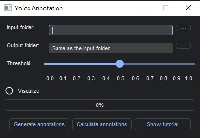
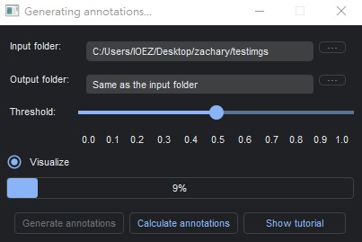
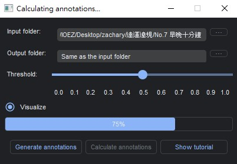
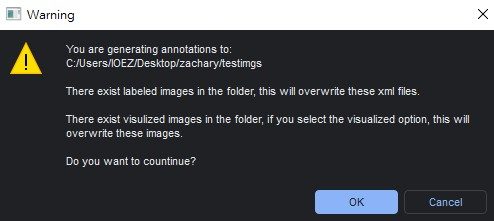
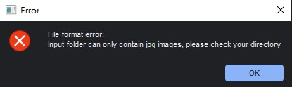
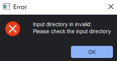
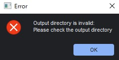
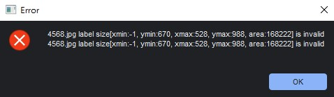

## Getting Started

The yoloxm.onnx is the onnx file generated from yolox training. 

The onnx file use in this application is trained on 640x640 images with yolox_m model. [[Yolox Github]](https://github.com/Megvii-BaseDetection/YOLOX)

### Python script deployment

You can simply execute the python file, after you installed all the requirement packages.

The python version is 3.8.3

```
git clone [this repo](https://github.com/ZachKLYeh/Yolox_Annotation_Application.git)
```
```
cd Yolox_Annotation_Application
```
```
pip3 install -r requirements.txt
```
```
python main.py
```

### Pyinstaller deployment

Also, this script can be wrap up into executable file via pyinstaller.

You can generate the executable application by executing these commands.

The executable file reside in Yolox_Annotation_Application/dist/main.exe

```
git clone [this repo](https://github.com/ZachKLYeh/Yolox_Annotation_Application.git)
```
```
cd Yolox_Annotation_Application
```
```
pip install pyinstaller
```
```
pyinstaller main.py --onefile --add-data "yoloxm.onnx;." --windowed
```
```
cd dist
```
```
main.exe
```


## Feature Introduction



### Generate xml format annotations:

* Select the input folder and output folder

> Input folder can only contain jpg images, other files will raise an error.
> The default setting is to set the output folder the same as the input folder.
> You can also use the button "..." to utilize file browser.

* Select threshold

> The threshold is the confidence threshold of prediction, higher threshold will result in higher accuracy.
> However, the detected object will be less. The default threshold is 0.5(maximum = 1.0).

* Select whether to visualize

> If you select the visualize option, this will create a "visualized_images" folder in your designated output folder.
> However, if there's already a "visualized_images" folder, this will raise a warning.
> Making sure you are notified of overwriting these images.

* Press "Generate annotations" button

> This will generate the result, both annotations and visualized images.
> After the generation. There will be a pop up window, indicating the annotation path and visualizing images path.



### Caluculate annonation instance:

* Select input folder

> The calculation only takes the input folder. Other options are not considered.

* Press "Calculate annotations" button

> This will calculate label instances in the input folder, also sub folders in the input folder.
> The result will be reported in a pop up window after calculation.



## Warning Messages



### Xml exist warning

> This is the case when your designated output folder already have labeled data.
> There will be a warning, you can decide whether to overwrite the xml files.

### Visualized image exist warning

> This is the case when your designated output folder already have visualized images.
> There will be a warning, you can decide whether to overwrite the image files.

## Error Messages

### File format error

> If the input folder exist some files except for jpg and xml format, this will raise an error.



### Invalid path error

> If your input folder or output folder path does not exist, this will raise an error.




### Invalid label error

> If your xml file have bonding box location that exceed image size, this will raise an error.
> The error will report the xml file that has invalid bonding box location.


